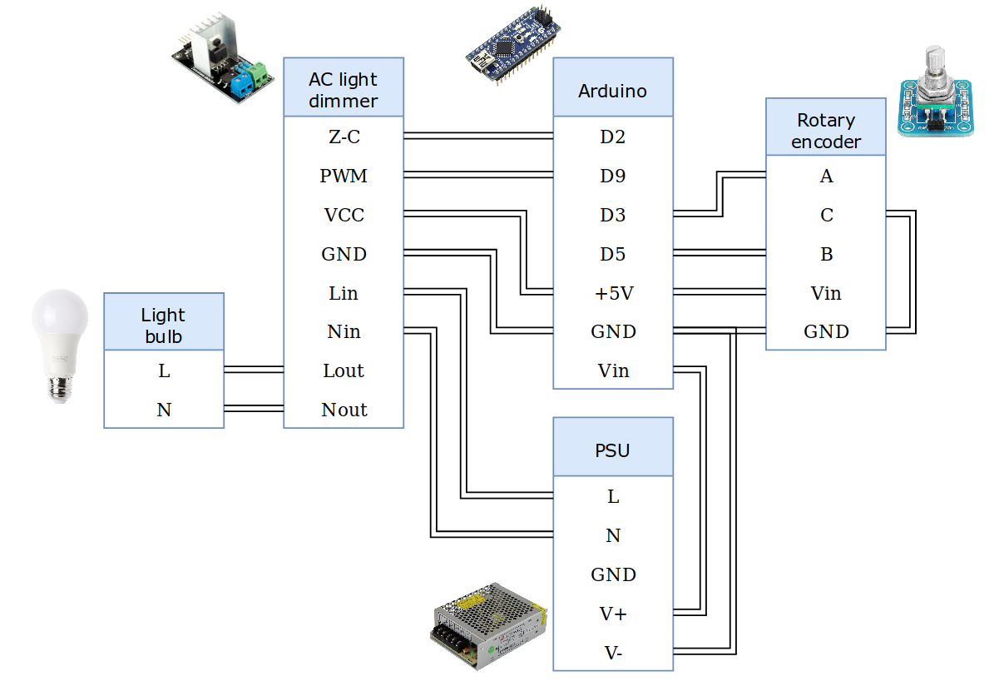

# Dimmable night lamp

- AC light dimming controlled by rotary encoder
- 3d printed lamp design in the shape of a mushroom

## Arduino code adapted from

- AC light dimmer: https://www.instructables.com/id/Arduino-controlled-light-dimmer-The-circuit/
- Rotary encoder: https://www.mathertel.de/Arduino/RotaryEncoderLibrary.aspx

## Circuit

    

## 3d prints

[Onshape file](https://cad.onshape.com/documents/18eb6e605793d25ea773f81d/w/6521c0d1b9b9e777c69c406c/e/59e82885677739ed15fef912)

    

